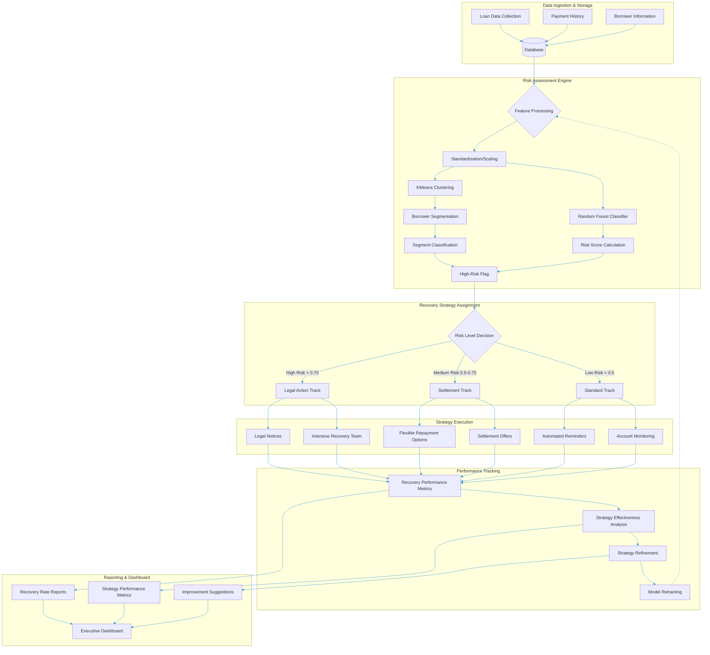

# Loan-Recovery-Engine


A data-driven approach to optimize loan recovery strategies based on borrower segmentation and risk prediction.

## 📊 Project Overview

This project implements an intelligent loan recovery system that uses machine learning to:
- Analyze loan data and borrower behavior patterns
- Segment borrowers based on financial profiles
- Calculate risk scores for potential defaults
- Recommend tailored recovery strategies for different risk levels
- Track and optimize recovery performance

## 🏗️ System Architecture



## 🔍 Key Features

- **Data-Driven Analysis**: Comprehensive analysis of loan data, payment history, and borrower profiles
- **Intelligent Borrower Segmentation**: K-Means clustering to identify distinct borrower segments
- **Risk Assessment**: Random Forest classifier to calculate precise risk scores
- **Personalized Recovery Strategies**: Tailored approaches based on risk levels:
  - High Risk: Legal actions and intensive recovery efforts
  - Medium Risk: Settlement offers and flexible repayment options
  - Low Risk: Automated reminders and account monitoring
- **Performance Tracking**: Continuous monitoring of recovery rates and strategy effectiveness
- **Strategy Refinement**: Data-driven approach to optimize recovery methods over time

## 📈 Visualizations

The project includes several visualizations to better understand the loan data:
- Distribution of Loan Amounts and Monthly Income
- Impact of Payment History on Recovery Status
- Effect of Missed Payments on Loan Recovery
- Relationship between Monthly Income, Loan Amount, and Recovery Status
- Borrower Segments Visualization

## 🛠️ Technologies Used

- **Python**: Core programming language
- **Pandas**: Data manipulation and analysis
- **Scikit-learn**: Machine learning algorithms (KMeans, RandomForest)
- **Plotly**: Interactive visualizations
- **StandardScaler**: Feature normalization
- **Train-Test Split**: Model validation

## 🚀 Getting Started

### Prerequisites
- Python 3.8+
- Required packages: pandas, plotly, scikit-learn

### Installation

```bash
# Clone this repository
git clone https://github.com/yourusername/loan-recovery-engine.git

# Navigate to the project directory
cd loan-recovery-engine

### Running the Analysis

```bash
# Run the main analysis script
python loan_recovery_engine.py
```

## 📋 Sample Results

### Borrower Segmentation
| Segment | Description | Risk Level | Recovery Strategy |
|---------|-------------|------------|-------------------|
| 0 | Moderate Income, High Loan Burden | High | Legal action & intensive recovery |
| 1 | High Income, Low Default Risk | Low | Automated reminders & monitoring |
| 2 | Moderate Income, Medium Risk | Medium | Settlement offers & flexible options |
| 3 | High Loan, Higher Default Risk | High | Legal action & intensive recovery |

## 📄 License

This project is licensed under the MIT License - see the [LICENSE](LICENSE) file for details.
